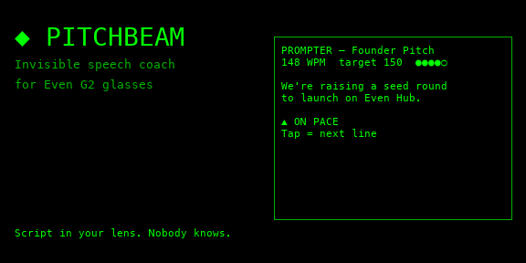
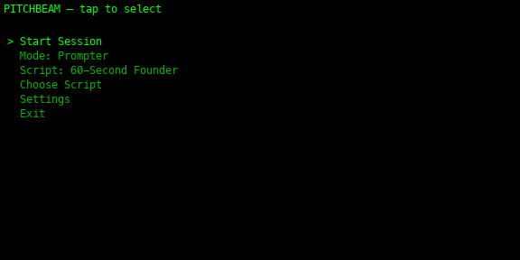
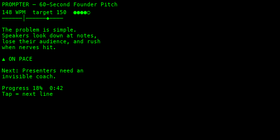
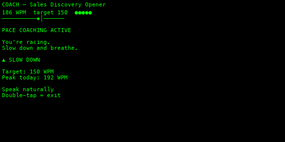
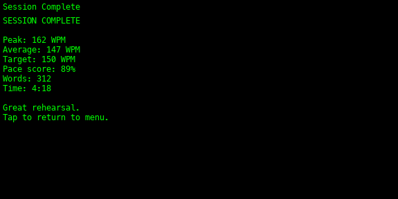
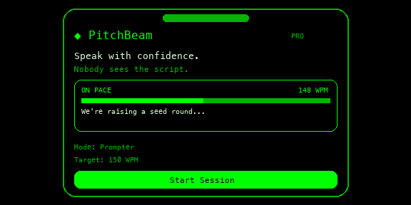

# PitchBeam — Even G2 Teleprompter

Teleprompter and live speech pace coaching for Even Realities G2 glasses. Scroll scripts on the HUD, get WPM feedback from the phone mic, and review session summaries.

## Screenshots

| View | Preview |
|------|---------|
| [Cover](#) |  |
| [Menu](#) |  |
| [Prompter](#) |  |
| [Pace coach](#) |  |
| [Summary](#) |  |
| [Phone companion](#) |  |


## Run

Requires **Node.js 20+**. Microphone permission is requested on the phone for pace coaching.

### Linux / macOS

```bash
git clone <your-repo-url>
cd pitchbeam
npm install
npm run dev
npm run simulate
npm run pack
```

### Windows

```powershell
git clone <your-repo-url>
cd pitchbeam
npm install
npm run dev
npm run simulate
npm run pack
```

## Controls

- **Scroll** scripts and menu items with temple touchpad or R1 ring
- **Tap** to select; double-tap to exit
